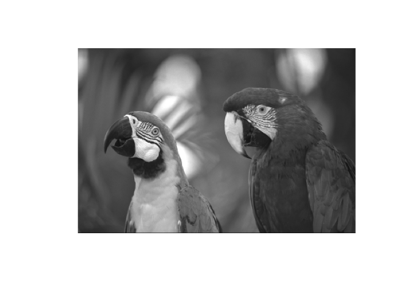
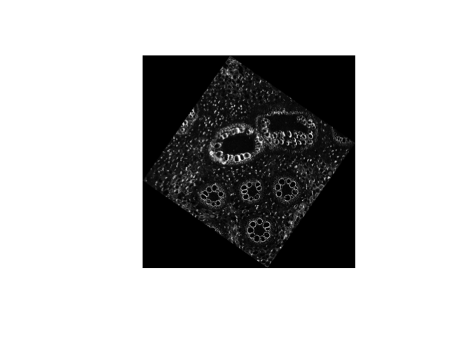

<!-- README.md is generated from README.qmd. Please edit that file -->

# ImageArray

**ImageArray** provides a unified, memory‑efficient way to work with
pyramidal and non‑pyramidal images using the `DelayedArray` package in
Bioconductor. It stores large images in memory or on disk (as **HDF5**
or **Zarr**), allows array‑like manipulations, and applies common image
operations consistently across all pyramid levels without loading arrays
in memory.

- **Pyramids:** multi‑resolution stacks of, e.g., from HDF5, Zarr or
  OME‑TIFF (Bio-formats) images as a single object.
- **Interoperability:** plays nicely with image classes across
  R/Bioconductor, such as **EBImage** or **magick**.
- **Delayed operations:** NGFF transformations (scale, translation,
  affine), and imaging operations (negation, cropping, slicing) –
  performed lazily, without loading in memory, via `DelayedArray`.
- **Backends:** HDF5 and Zarr on‑disk storage using **HDF5Array** and
  **Rarr** packages.

## What are image pyramids?


An **image pyramid** is a multi‑scale representation built by repeatedly
smoothing and down‑sampling an image (e.g. Gaussian/Laplacian pyramids).

Pyramids make zooming, visualization, and scale‑aware analysis efficient
– a staple in digital pathology and large microscopy images.

## Installation

You can install ImageArray from Bioconductor with:

``` r
if (!requireNamespace("BiocManager", quietly = TRUE)) {
    install.packages("BiocManager")
}
BiocManager::install("ImageArray")
```

## Getting started

**ImageArray** allows saving images to either HDF5 or Zarr where you can
define the number of layers of the pyramids (i.e. number of downscaled
images) and the path to the on-disk h5 file or zarr store.

``` r
library(ImageArray)
#> Loading required package: EBImage
#> Warning: multiple methods tables found for 'transform'
#> 
#> Attaching package: 'ImageArray'
#> The following object is masked from 'package:EBImage':
#> 
#>     affine
library(EBImage)

img_file <- system.file("images", "sample.png", package="EBImage")
img = readImage(img_file)

dir.create(td <- tempfile())
h5_sample <- file.path(td, "sample")
imgarray <- writeImageArray(img, 
                            format = "h5", 
                            output = h5_sample, 
                            nlevels = 2)
#> Warning in writeImageArray(img, format = "h5", output = h5_sample, nlevels =
#> 2): The file extension of the output path does not match the specified format
#> (h5). The object will be saved as h5 format.
imgarray
#> ImageArray Object (x,y) 
#> Scales (2): (768,512) (384,256)
```

Each level of a pyramid can be rasterized at any time, and thus plotted.

``` r
imgraster <- as.raster(imgarray, level = 2)
plot(imgraster)
```



<br>

By using the `max.pixel.size`, we can request **ImageArray** to return a
pyramid level whose both width (`X`) and height (`Y`) are lower than
some pixel size, e.g. 400. Hence, **ImageArray** can be used by other
implementations to plot images in a memory-efficient way.

``` r
# visualize 
bfa.raster <- as.raster(imgarray, max.pixel.size = 400)
dim(bfa.raster)
#> [1] 256 384
```

We can crop or slice images via lazy/delayed indexing again without
loading the image in the memory.

``` r
# crop or slice via indexing
imgarray <- imgarray[100:200, 200:300]
imgarray
#> ImageArray Object (x,y) 
#> Scales (2): (101,101) (51,51)
```

You can also use an existing **OME-TIFF** (or any Bioformats image) to
create an ImageArray object which we use **RBioFormats** package.

``` r
library(RBioFormats)
#> BioFormats library version 7.3.0
ome_file <- system.file("extdata", 
                        "xy_12bit__plant.ome.tiff", 
                        package = "ImageArray")
imgarray   <- createImageArray(ome_file, 
                               series = 1, 
                               resolution = 1:2)
imgarray
#> ImageArray Object (x,y) 
#> Scales (2): (512,512) (256,256)
```

## Transformations

A number of memory-efficient (delayed or lazy) operations are available
for pyramid images, such as horizontal or vertical flipping and
negation.

These operations also include coordinate transformations, including
translation, scaling, rotation and affine transformations. See
[OME-NGFF](https://ngff.openmicroscopy.org/rfc/5/index.html#coordinatetransformations-metadata)
webpage to learn more about coordinate systems and transformations.

``` r
imgarray_rot <- rotate(imgarray, angle = 35)
imgarray_rot
#> ImageArray Object (x,y) 
#> Scales (2): (713,713) (357,357)
plot(as.raster(imgarray_rot))
```


